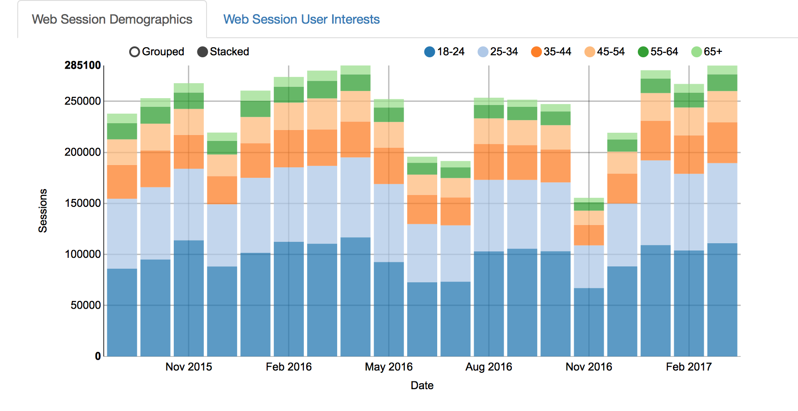
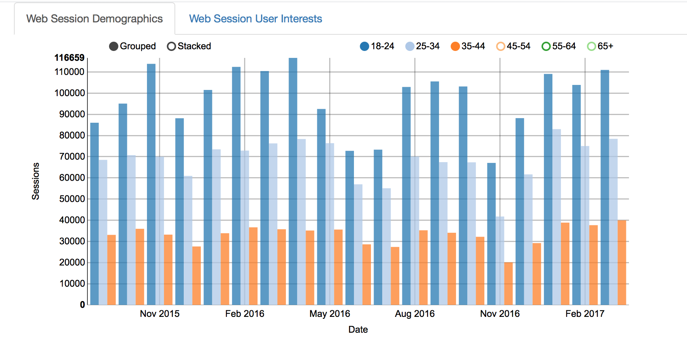
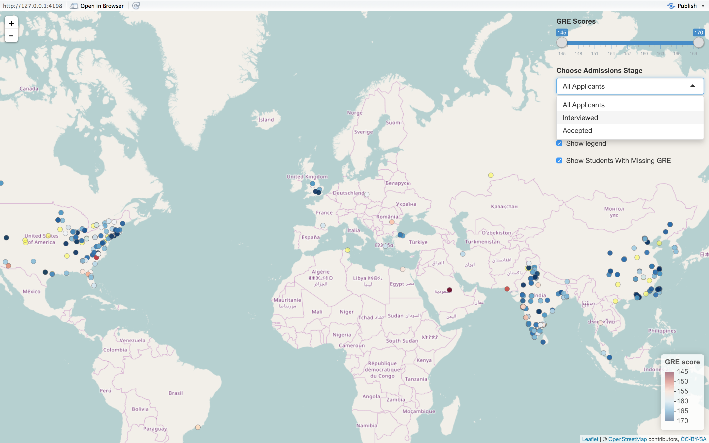

# clevername-final
final created for clevername

In this visualization project we used two separate datasets relating to USF Masters in Analytics program (MSANs). These visualizations are intended to be used internally by MSANs administration.

# MSAN's Website Analytics 
To run this visualization:
shiny::runGitHub("clevername-final","usfviz",subdir="audience")

 First, we queried from google analytics API containing demographic and user interest data. We have display this into two plots. This plot can be displayed stacked or grouped for different perspectives. It can also be subsetted by age to more accurately display proportions of specific groups.
 
 ## Web Sessions Demographics
 
 
 This plot can be displayed stacked or grouped for different perspectives. It can also be subsetted by age to more accurately display proportions of specific groups.
 
 The second plot visualizes visitors interest. Google is very good at knowing what their users are interested in. Lucky for us they provide this data in their API. In this plot you can hover over all the interest categories to see what MSANs webpage visitor are interested in. As you can see in this image, a relatively high percentage are interested in Colleges and Universities.
 
# MSAN's Admissions
To run this visualization:
shiny::runGitHub("clevername-final","usfviz",subdir="map")

The next visualization easily shows the population of students applying to MSANs. 
 

The markers on the map represent the location of the applicants undergraduate universities. The markers are color coded by GRE scores. The applicants can be subsetted by who made it through different stages of the admissions process and gender. If the markers are clicked on the specific student information is displayed.
 
